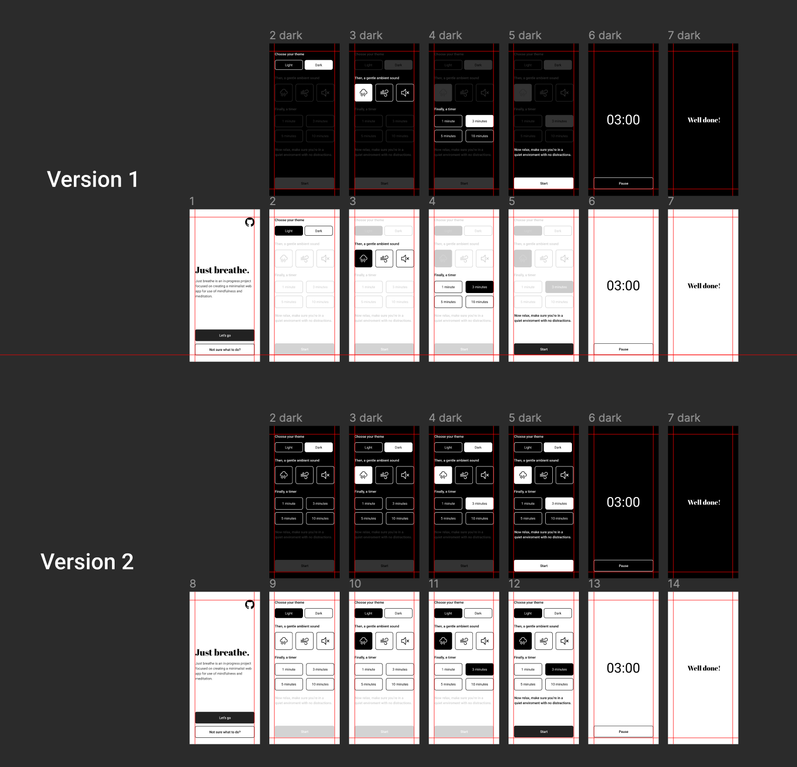

# just-breathe

🧘 Just breathe is an in-progress project focused on creating a minimalist web app for use of mindfulness and meditation.

Inspired by a book called 'When Things Fall Apart' by [Pema Chödrön](https://en.wikipedia.org/wiki/Pema_Chödrön).

Current stage:

- [x] Research
- [x] Definition
- [x] Brainstorming, Conclusions
- [x] Prototyping

## Research

**Just breathe** is meant to be a mobile-first experience, focusing on accessibility and ease of use. No fireworks, no complex systems. As a long time meditation practicioner, when presented with a myriad of choices I often get flustered and irritated, which results in a disturbed practice. The goal of this excercise is to create a minimalist platform for all who get easily distracted. This has proven to be a key **paint point** for people I have consulted in this matter, thus providing me with a great opportunity to create this project.

## Definition

Intuitive; Clear; Minimalist. These are keywords this project has to stand by. The interface has to be incredibly easy and clear in terms of signifiers, and choices the user is presented with have to be concise enough to minimize the chance for frustration.

## Brainstorming, Conclusions

There are no accounts, no and no stats. There's nothing to achieve here apart from the act of mindfulness itself. This is to remove instant gratification, and to foucs on the task at hand. User is presented with a theme of choice (dark or light), timer, ambient noise of choice, and a start button. While not the most lucrative approach, this excercise is meant to create a space for people to remove themselves from distractions and mental triggers that are often implemented within apps for profit.

Additionaly, there's a 'how to' page for users who are not sure where to start, or who are perhaps new to meditation. This is a friendly place with a bunch of resources to learn about the art of mindfulness. All this, clearly marked with **accessibility** in mind. It has to be easy to use, by **everyone**.

## Prototyping

[Figma file - work in progress](https://www.figma.com/file/96uvXp9ipCXgezTFGl3iYW/Untitled?node-id=0%3A1)

## Resources

Fonts used:
[Abril Fatface](https://fonts.google.com/specimen/Abril+Fatface?query=abril),
[Roboto](https://fonts.google.com/specimen/Roboto?query=Roboto)

All icons provided by [Iconify](https://www.figma.com/community/plugin/735098390272716381).

Ambient sound effects:
[Wind](https://freesound.org/people/michieldb.nl/sounds/217457/),
[Rain](https://freesound.org/people/babuababua/sounds/344430/)

Web Audio library:
[Pizzicato.js](https://alemangui.github.io/pizzicato/)
